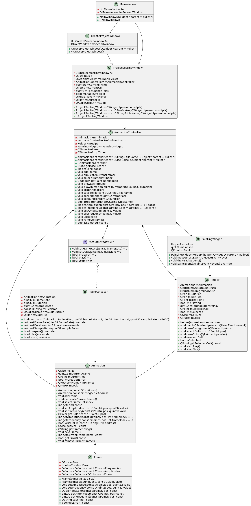

# Vibmory_HapticPatternGenerator

Welcome to **Vibmory_HapticPatternGenerator**. This is a simple tool created to help users, regardless of their level of experience, to manage and visualize multiple speakers as haptic actuators and generate a pattern to test. Developed with QT and C++, it aims to provide a clear and concise interface for those who are interested in learning about or working with haptic technologies.

## Purpose

This software is an attempt to offer a means for understanding and interacting with haptic cells, allowing users to modify amplitude and frequency settings for individual actuators during specific time that makes a vibration pattern. Its application is versatile, suited for anyone curious about exploring haptics, whether for learning, experimentation, or research.

## Key Features

1. **Manage Multiple Acuators:** Simultaneously control several haptic actuators, each represented as a separate cell.
2. **Visualize in Real-Time:** See the status and changes of each cell in real-time.
3. **Customize Animations:** put different frames together and play them to make a haptic animation.
4. **Synchronize Actuators:** Manage all actuators cohesively for a unified haptic experience.

## Published Work

This tool has been developed and utilized in a research study, and the findings have been documented in a paper titled "[Vibmory - Mapping Episodic Memories to Vibrotactile Patterns](https://dl.acm.org/doi/abs/10.1145/3569009.3572747)". This paper does not endorse but rather employs the software as a means to conduct experiments. For those interested in the practical applications and potentials of this software, this paper could serve as a useful resource.

## How to Get Started

TODO

## Diagrams and Architecture

Here is a simple class diagram of the project for a better overview of the project. 

## Contributing

This is not a very active project and it is developed for Tallinn University but if you have suggestions or improvements, we welcome your contributions. You can check the issues and start there. There is not a restrict rules to contribute, just start, we will help :). 
