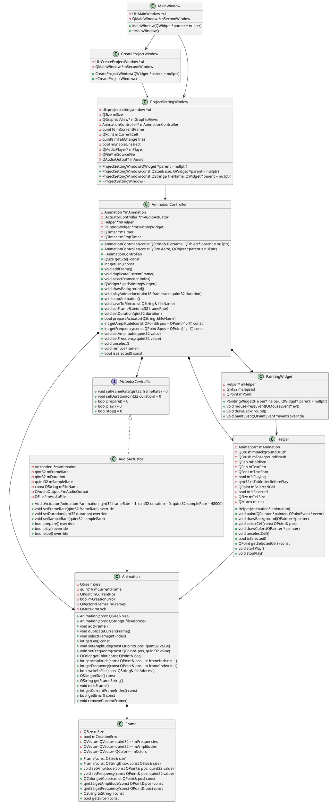

## Class Diagram

Here is the class diagram to give a good overview of the project. 

```plantuml
@startuml
class Animation {
    - QSize mSize
    - quint16 mCurrentFrame
    - QPoint mCurrentPos
    - bool mCreationError
    - QVector<Frame> mFrames
    - QMutex mLock
    + Animation(const QSize& size)
    + Animation(const QString& fileAddress)
    + void addFrame()
    + void duplicateCurrentFrame()
    + void selectFrame(int index)
    + int getLen() const
    + void setAmplitude(const QPoint& pos, quint32 value)
    + void setFrequency(const QPoint& pos, quint32 value)
    + QColor getColor(const QPoint& pos)
    + int getAmplitude(const QPoint& pos, int frameIndex = -1)
    + int getFrequency(const QPoint& pos, int frameIndex = -1)
    + bool writeInFile(const QString& fileAddress)
    + QSize getSize() const
    + QString getFrameString()
    + void nextFrame()
    + int getCurrentFrameIndex() const
    + bool getError() const
    + void removeCurrentFrame()
}

class AnimationController {
    - Animation *mAnimation
    - IActuatorController *mAudioActuator
    - Helper *mHelper
    - PaintingWidget *mPaintingWidget
    - QTimer *mTimer
    - QTimer *mStopTimer
    + AnimationController(const QString& fileName, QObject* parent = nullptr)
    + AnimationController(const QSize &size, QObject *parent = nullptr)
    + ~AnimationController()
    + QSize getSize() const
    + int getLen() const
    + void addFrame()
    + void duplicateCurrentFrame()
    + void selectFrame(int index)
    + QWidget* getPaintingWidget()
    + void drawBackground()
    + void playAnimation(quint16 framerate, quint32 duration)
    + void stopAnimation()
    + void saveToFile(const QString& fileName)
    + void setFrameRate(qint32 frameRate)
    + void setDuration(qint32 duration)
    + bool prepareActuator(QString &fileName)
    + int getAmplitude(const QPoint& pos = QPoint(-1,-1)) const
    + int getFrequency(const QPoint &pos = QPoint(-1, -1)) const
    + void setAmplitude(quint32 value)
    + void setFrequency(quint32 value)
    + void unselect()
    + void removeFrame()
    + bool isSelected() const
}

class AudioActuator {
    - Animation *mAnimation
    - qint32 mFrameRate
    - qint32 mDuration
    - quint32 mSampleRate
    - const QString mFileName
    - QAudioOutput *mAudioOutput
    - QFile *mAudioFile
    + AudioActuator(Animation *animation, qint32 frameRate = 1, qint32 duration = 0, quint32 sampleRate = 48000)
    + void setFrameRate(qint32 frameRate) override
    + void setDuration(qint32 duration) override
    + void setSampleRate(quint32 sampleRate)
    + bool prepare() override
    + bool play() override
    + bool stop() override
}

class CreateProjectWindow {
    - Ui::CreateProjectWindow *ui
    - QMainWindow *mSecondWindow
    + CreateProjectWindow(QWidget *parent = nullptr)
    + ~CreateProjectWindow()
}

class Frame {
    - QSize mSize
    - bool mCreationError
    - QVector<QVector<quint32>> mFrequencies
    - QVector<QVector<quint32>> mAmplitudes
    - QVector<QVector<QColor>> mColors
    + Frame(const QSize& size)
    + Frame(const QString& csv, const QSize& size)
    + void setAmplitude(const QPoint& pos, quint32 value)
    + void setFrequency(const QPoint& pos, quint32 value)
    + QColor getColor(const QPoint& pos) const
    + qint32 getAmplitude(const QPoint& pos) const
    + qint32 getFrequency(const QPoint& pos) const
    + QString toString() const
    + bool getError() const
}

interface IActuatorController {
    + void setFrameRate(qint32 frameRate) = 0
    + void setDuration(qint32 duration) = 0
    + bool prepare() = 0
    + bool play() = 0
    + bool stop() = 0
}

class Helper {
    - Animation* mAnimation
    - QBrush mBackgroundBrush
    - QBrush mForegroundBrush
    - QPen mBoldPen
    - QPen mTextPen
    - QFont mTextFont
    - bool mIsPlaying
    - qint32 mTabIndexBeforePlay
    - QPoint mSelectedCell
    - bool mIsSelected
    - QSize mCellSize
    - QMutex mLock
    + Helper(Animation* animation)
    + void paint(QPainter *painter, QPaintEvent *event)
    + void drawBackground(QPainter *painter)
    + void selectCell(const QPoint& pos)
    + void drawColors(QPainter * painter)
    + void unselectCell()
    + bool isSelected()
    + QPoint getSelectedCell() const
    + void startPlay()
    + void stopPlay()
}

class MainWindow {
    - Ui::MainWindow *ui
    - QMainWindow *mSecondWindow
    + MainWindow(QWidget *parent = nullptr)
    + ~MainWindow()
}

class PaintingWidget {
    - Helper* mHelper
    - qint32 mElapsed
    - QPoint mPoint
    + PaintingWidget(Helper* helper, QWidget* parent = nullptr)
    + void mousePressEvent(QMouseEvent* evt)
    + void drawBackground()
    + void paintEvent(QPaintEvent *event) override
}

class ProjectSettingWindow {
    - Ui::projectsettingwindow *ui
    - QSize mSize
    - QGraphicsView* mGraphicViews
    - AnimationController* mAnimationController
    - quint16 mCurrentFrame
    - QPoint mCurrentCell
    - quint8 mTabChangeTries
    - bool mEnableUnselect
    - QMediaPlayer* mPlayer
    - QFile* mSourceFile
    - QAudioOutput* mAudio
    + ProjectSettingWindow(QWidget *parent = nullptr)
    + ProjectSettingWindow(const QSize& size, QWidget *parent = nullptr)
    + ProjectSettingWindow(const QString& fileName, QWidget *parent = nullptr)
    + ~ProjectSettingWindow()
}

AnimationController *--> Animation
AnimationController *--> IActuatorController
AnimationController *--> PaintingWidget 
AnimationController *--> Helper
AudioActuator --> Animation
CreateProjectWindow --> ProjectSettingWindow 
Helper --> Animation
MainWindow --> CreateProjectWindow
MainWindow --> ProjectSettingWindow 
PaintingWidget --> Helper
ProjectSettingWindow --> AnimationController
Animation *--> Frame

IActuatorController <|.. AudioActuator
@enduml
```